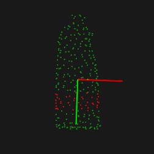
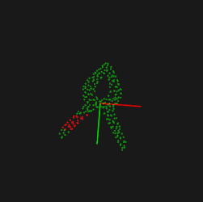
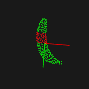
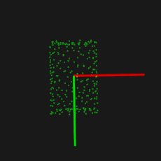
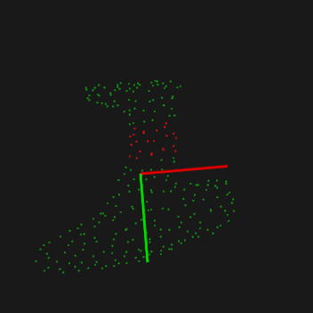

# Grasp-Based-On-Lateral-Curvatures-and-Geometric-Primitives

Simplified python grasping code from the paper *insert paper here*

## Requeriments

### ROS(Tested on ROS Melodic and Ubuntu 18)

http://wiki.ros.org/melodic/Installation/Ubuntu

### Python PCL

https://github.com/strawlab/python-pcl

### Numpy

```Shell
pip install numpy
```

### Scipy
```Shell
pip install scipy
```
## Usage







Publish the segmented object on topic:

```Shell
'/cloud_segmented'
```

The object should be aligned to the camera, which means that, having the knowledge of the object orientation is recommended. 

Some recommendations to estimate the 6D pose of an object:

https://github.com/cvlab-epfl/segmentation-driven-pose

https://github.com/yuxng/PoseCNN

And methods already on PCL:

https://pointclouds.org/documentation/classpcl_1_1_p_c_a.html

https://pointclouds.org/documentation/classpcl_1_1_iterative_closest_point.html

Run the code using:

```Shell
roslaunch grasp_python grasp.launch
```
The lauch file will have the following parameters:

*gripper_height: The height of the gripper finger.
*gripper_width: The distance between the griper fingers when fully open.
*n: Influence the number of points used to calculate the curvature.
*frame: The ROS camera frame, used for debugging/visualization on RVIZ.


The region to grasp will be publish on  the topic:

```Shell
'/grasp_region'
```

And the grasping type will be pushed on:

```Shell
'/grasp_type'
```

Where type will be:

* -2 : When no good region was found
* -1 : When the object is a geoemtric primitive
* 0 or Greater: When a grasping region was found, where the type is the region ID.

## Citing

**Soon®**

